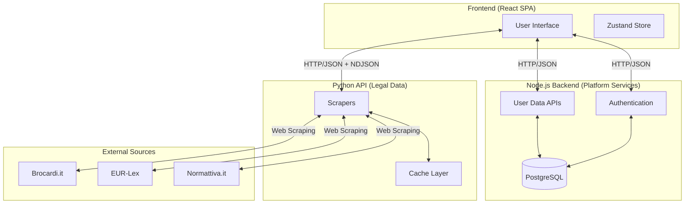
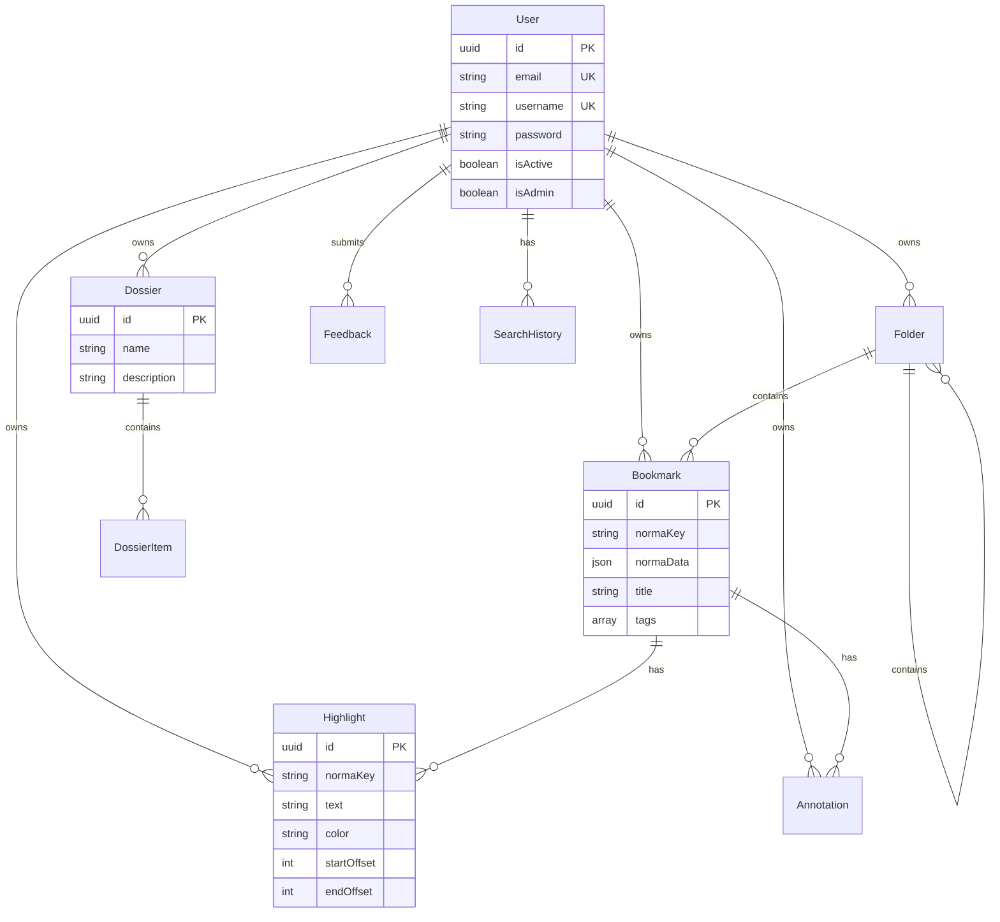
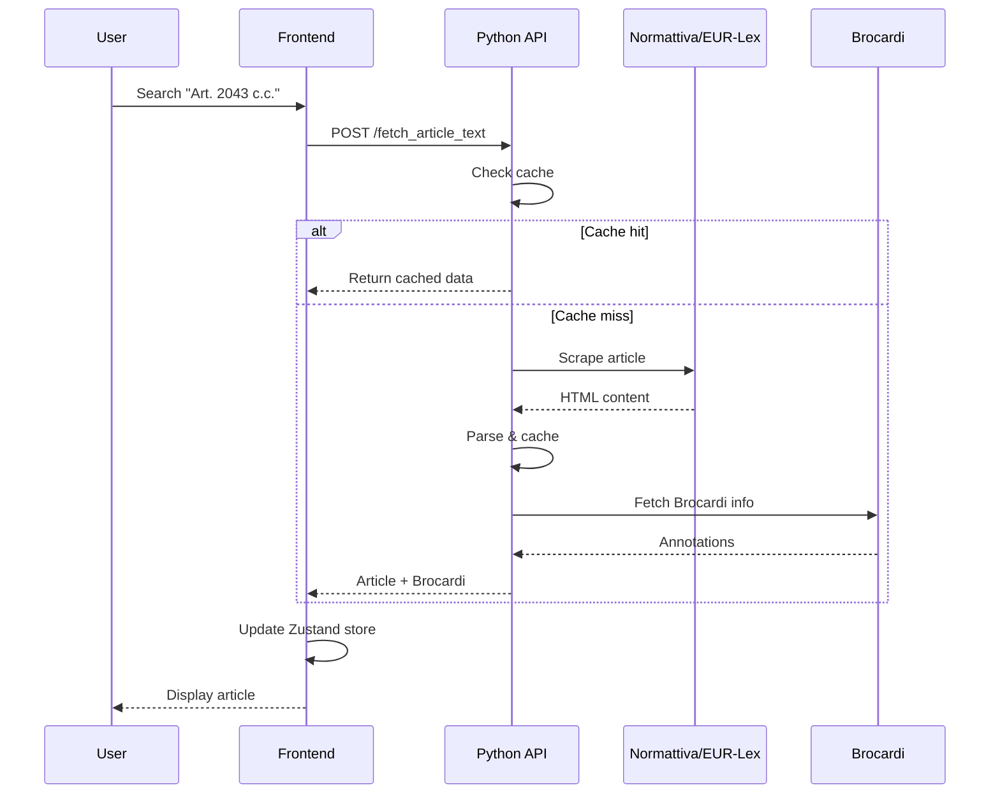
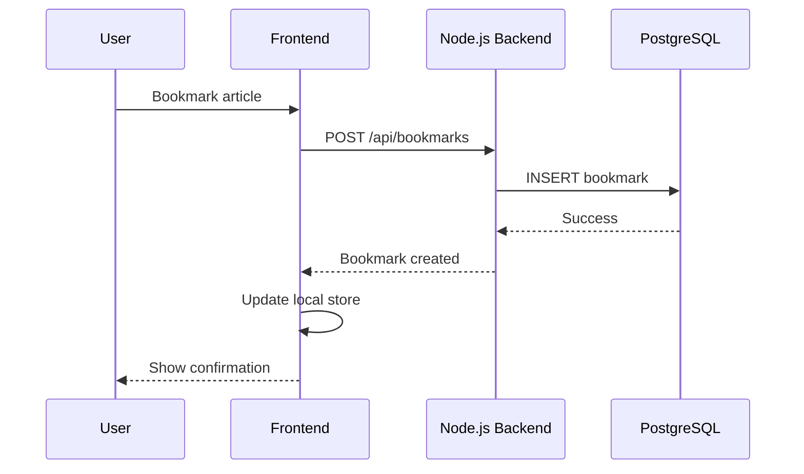
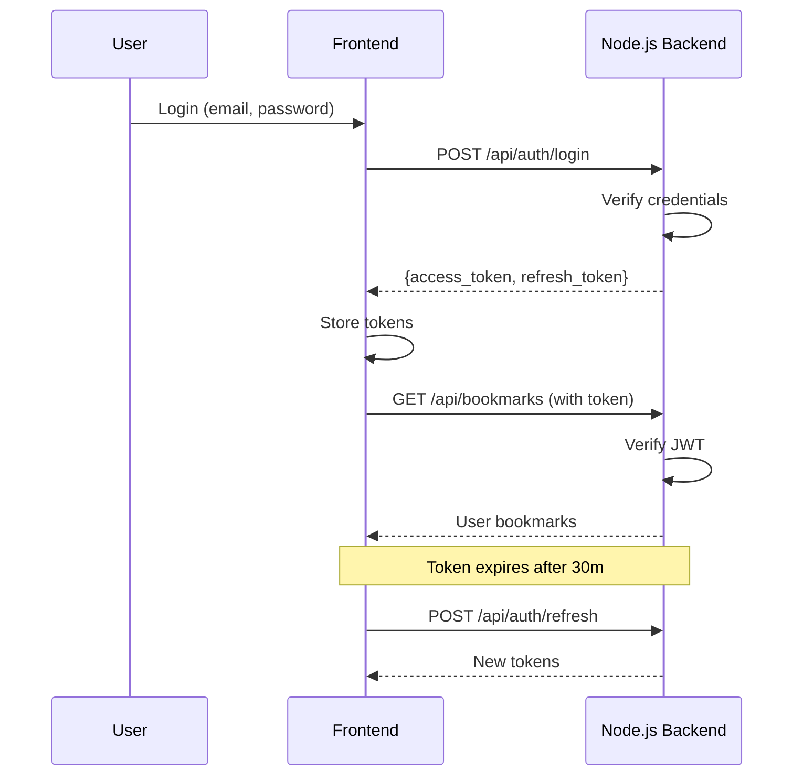
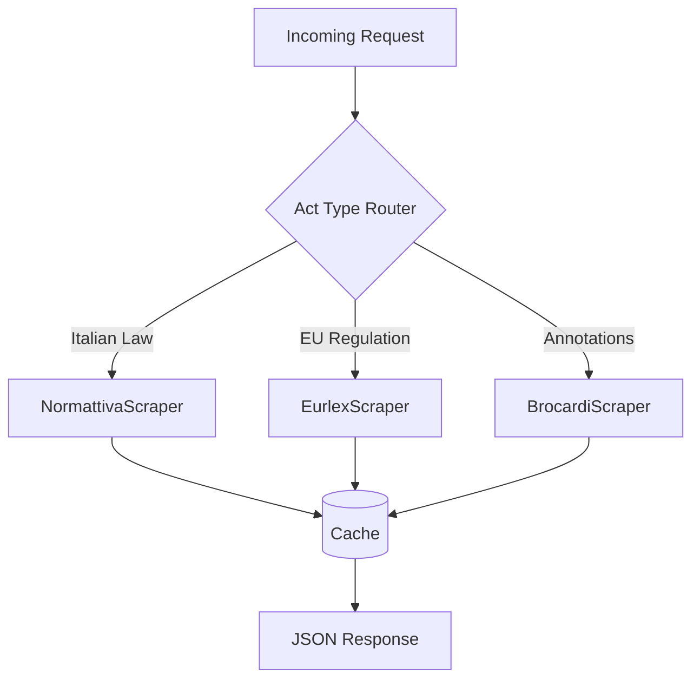

# VisuaLex Architecture

VisuaLex is a full-stack web application for advanced legal research and visualization. This document provides a comprehensive technical overview of the system architecture, data flow, and component interactions.

---

## System Overview

The application follows a **three-tier architecture** with clearly separated concerns:



---

## Port Configuration

| Service | Port | Description |
|---------|------|-------------|
| **Python API** | 5000 | Legal data retrieval, PDF export |
| **Node.js Backend** | 3001 | Authentication, user data, platform services |
| **Frontend (dev)** | 5173 | Vite development server |
| **Prisma Studio** | 5555 | Database GUI (optional) |

---

## Technical Stack

### Frontend (`/frontend`)

| Category | Technologies |
|----------|-------------|
| **Core** | React 19, TypeScript, Vite 7 |
| **State** | Zustand, Immer |
| **Styling** | TailwindCSS v4, Framer Motion |
| **Routing** | React Router DOM v7 |
| **HTTP** | Axios |
| **UI** | Lucide React, React RND, Floating UI, cmdk |
| **Utilities** | Zod, DOMPurify, jsPDF, date-fns |

### Node.js Backend (`/backend`)

| Category | Technologies |
|----------|-------------|
| **Framework** | Express.js |
| **ORM** | Prisma |
| **Database** | PostgreSQL |
| **Auth** | JWT (jsonwebtoken, bcryptjs) |
| **Validation** | Zod |
| **Language** | TypeScript |

### Python API (`/visualex_api`)

| Category | Technologies |
|----------|-------------|
| **Framework** | Quart (async Flask-like) |
| **Scraping** | BeautifulSoup4, Playwright |
| **HTTP** | aiohttp, requests |
| **Caching** | aiocache |
| **Logging** | structlog |
| **CORS** | quart_cors |

---

## Service Architecture

### 1. Frontend (React SPA)

The frontend is a Single Page Application providing the user interface for legal research.

**Key Responsibilities:**
- Search form and article display
- Multi-tab workspace with draggable windows
- Study mode for focused reading
- Bookmarks, annotations, and highlights
- Dossier management
- Theme switching and settings

**State Management:**
- Global state via Zustand store
- Persisted data synced with Node.js backend
- Local UI state in components

### 2. Node.js Backend (Platform Services)

Handles all user-related data and authentication.

**Key Responsibilities:**
- User registration and login
- JWT token management
- Bookmarks CRUD
- Folders and organization
- Annotations and highlights
- Dossiers (research collections)
- Search history
- Feedback collection

**Database:** PostgreSQL with Prisma ORM

### 3. Python API (Legal Data)

Retrieves and processes legal texts from external sources.

**Key Responsibilities:**
- Normattiva scraping (Italian laws)
- EUR-Lex scraping (EU regulations)
- Brocardi scraping (legal annotations)
- Document tree extraction
- PDF export
- Server-side caching

---

## Database Schema



See [Node.js Backend Documentation](backend/node_backend.md) for complete schema details.

---

## Data Flow

### Legal Data Retrieval



### User Data Sync



### Authentication Flow



---

## Scraper Architecture

The Python API routes requests to appropriate scrapers based on act type:



**Source Routing:**

| Act Types | Scraper |
|-----------|---------|
| Codice Civile, Codice Penale, Legge, D.Lgs., D.P.R., etc. | Normattiva |
| TUE, TFUE, CDFUE, Regolamento UE, Direttiva UE | EUR-Lex |
| Legal annotations | Brocardi (supplements Normattiva) |

---

## Caching Strategy

### Python API

| Cache Type | TTL | Purpose |
|------------|-----|---------|
| **Memory Cache** | 24 hours | In-process document cache |
| **Persistent Cache** | 24 hours | File-based cache in `/download/cache/` |
| **History** | Permanent | JSON file in `/data/history.json` |

### Frontend

| Storage | Data | Persistence |
|---------|------|-------------|
| **Zustand Store** | UI state, settings | Session (with localStorage hydration) |
| **Backend Sync** | Bookmarks, dossiers, annotations | Server-side (PostgreSQL) |

---

## Security

### Authentication

- **JWT Tokens**: Access (30m) + Refresh (7d)
- **Password Hashing**: bcrypt with 10 salt rounds
- **User Activation**: Admin approval required for new users

### API Protection

- **Rate Limiting**: 1000 requests / 10 minutes per IP (Python API)
- **CORS**: Configured for localhost origins
- **Input Validation**: Zod schemas on all endpoints

### Data Protection

- All user data cascades on user deletion
- Users can only access their own data
- Sensitive fields excluded from responses

---

## Error Handling

### Python API

Custom exception hierarchy with HTTP status mapping:

```
VisuaLexError (base)
├── ScraperError
│   ├── NetworkError (transient, status_code)
│   ├── DocumentNotFoundError (urn)
│   └── ParsingError (html_snippet)
├── ValidationError → 400
├── ResourceNotFoundError → 404
├── RateLimitExceededError → 429
└── ExtractionError → 500
```

### Node.js Backend

- `AppError` class with statusCode
- Global error handler middleware
- Consistent JSON error responses

---

## Development Workflow

### Starting All Services

```bash
./start.sh
```

Or manually:

```bash
# Terminal 1: Python API
source .venv/bin/activate && python app.py

# Terminal 2: Node.js Backend
cd backend && npm run dev

# Terminal 3: Frontend
cd frontend && npm run dev
```

### Development Proxies

Vite proxies API requests during development:

```
/api/*           → http://localhost:3001 (Node.js)
/fetch_*         → http://localhost:5000 (Python)
/stream_*        → http://localhost:5000 (Python)
/export_pdf      → http://localhost:5000 (Python)
```

---

## Deployment Considerations

### Production Build

```bash
# Frontend
cd frontend && npm run build  # Creates dist/

# Node.js Backend
cd backend && npm run build   # Compiles to dist/

# Python API
# Run with gunicorn or hypercorn for production
```

### Environment Variables

**Required for Production:**
- `JWT_SECRET`: Strong, unique secret
- `DATABASE_URL`: Production PostgreSQL URL
- `NODE_ENV`: Set to "production"
- `ALLOWED_ORIGINS`: Production domain(s)

### Scalability Notes

- Python API is stateless (can scale horizontally)
- Node.js Backend is stateless (can scale horizontally)
- Database is single point (consider read replicas)
- Cache is per-instance (consider Redis for shared cache)

---

## Related Documentation

- [Python API Setup](backend/python_api_setup.md)
- [Python API Reference](backend/python_api_reference.md)
- [Node.js Backend](backend/node_backend.md)
- [Frontend Setup](frontend/setup.md)
- [Component Library](frontend/component_library.md)
- [User Guide](user_guide.md)
