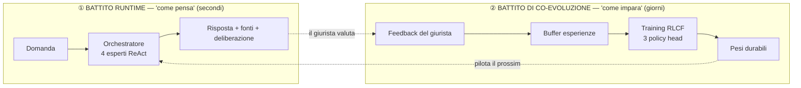
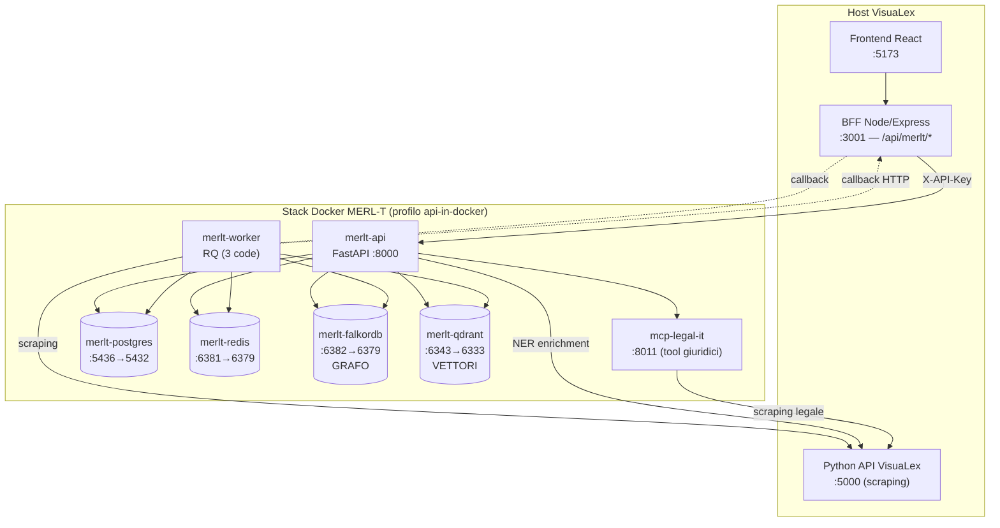
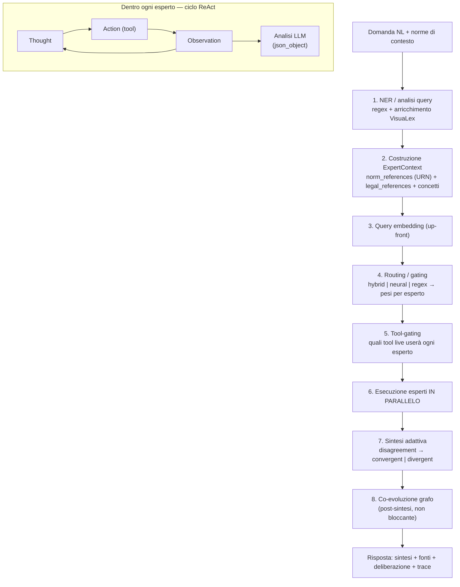
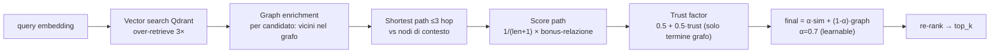
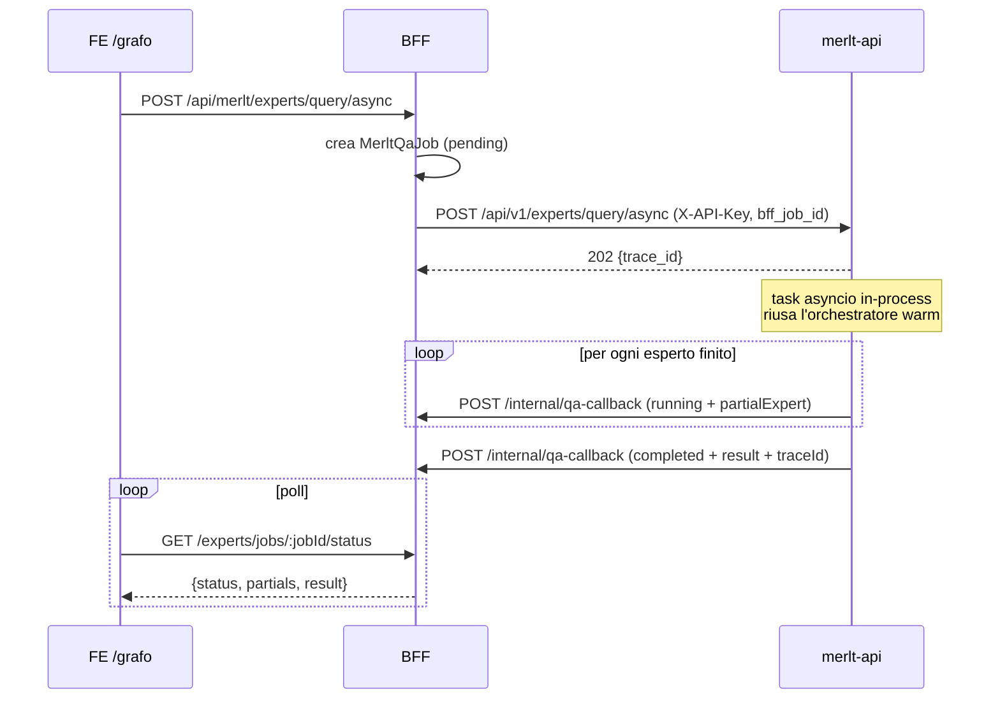
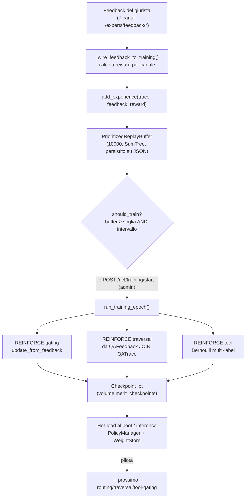
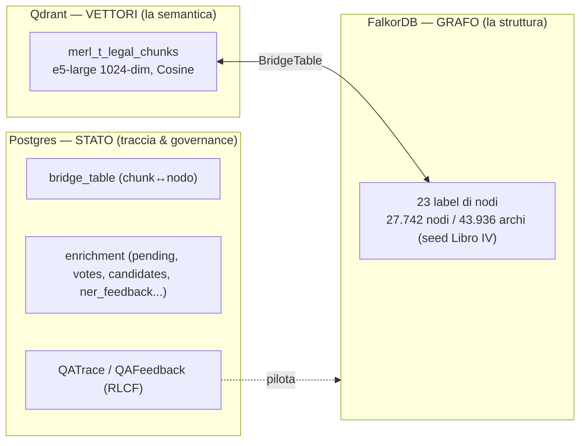

# MERL-T — Blueprint architetturale

> **Cos'è questo documento.** La mappa completa e verificata-sul-codice di MERL-T: la pipeline di
> ragionamento, i suoi componenti, il data flow e ogni elemento dell'architettura. È pensato per
> **capire il sistema e pilotarlo** — non è un tutorial di implementazione.
>
> **Come è stato prodotto.** Ricognizione read-only di 7 agenti paralleli sul codice reale
> (branch `visualex-merlt-main`, 17 luglio 2026). Dove il codice diverge dalle note storiche in
> `CLAUDE.md`, **vince il codice**: le divergenze sono raccolte nell'Appendice A.
>
> **Come leggerlo.** Le Parti 0–3 raccontano *come funziona* (topologia → come pensa → come impara →
> il substrato dati). La Parte 4 è il *catalogo* di ogni modulo. La Parte 5 è la tua *plancia di
> comando*. La Parte 6 è *infra & deploy*. Le appendici raccolgono divergenze, debito tecnico e un
> glossario.
>
> Riferimenti al codice nella forma `file:line` (es. `orchestrator.py:656`) sono ancore reali,
> relative a `merlt/merlt/` salvo diversa indicazione.

---

## Indice

- **Parte 0 — Vista d'insieme**
- **Parte 1 — Data flow runtime ("come pensa")**
- **Parte 2 — Il loop di co-evoluzione RLCF ("come impara")**
- **Parte 3 — Il substrato dati**
- **Parte 4 — Catalogo dei componenti**
- **Parte 5 — I tuoi punti di pilotaggio**
- **Parte 6 — Infra & deploy**
- **Appendice A — Divergenze dal CLAUDE.md**
- **Appendice B — Debito tecnico, codice morto e trappole**
- **Appendice C — Glossario per il giurista**

---

## Parte 0 — Vista d'insieme

### 0.1 Cos'è MERL-T, in una pagina

MERL-T è un **motore di ragionamento giuridico** che risponde a domande di diritto italiano
*deliberando* invece di limitarsi a generare testo. La domanda viene analizzata da un collegio di
**quattro esperti**, ognuno che incarna un **canone ermeneutico** dell'art. 12 delle preleggi:

| Esperto | Canone (art. 12 preleggi) | Come ragiona |
|---|---|---|
| **Literal** | interpretazione letterale | il "significato proprio delle parole" della norma |
| **Systemic** | interpretazione sistematica | i collegamenti tra norme (percorre il grafo) |
| **Principles** | principi generali dell'ordinamento | ratio, principi, valori |
| **Precedent** | (giurisprudenza) | massime e orientamenti |

Ogni esperto ragiona in autonomia con un ciclo **ReAct** (Thought → Action → Observation): decide
quali *strumenti giuridici* consultare (testo di legge live, grafo della conoscenza, giurisprudenza),
li chiama, osserva i risultati e itera. Un **sintetizzatore adattivo** poi integra le posizioni se
convergono o le contrappone se divergono (con rilevazione del disaccordo).

Ciò che rende MERL-T diverso da un chatbot è che **impara dal giurista**. Ogni risposta è tracciata; il
feedback dell'utente diventa segnale di addestramento (**RLCF** — *Reinforcement Learning from
Community Feedback*) che ripesa tre "manopole" neurali del ragionamento. E il **grafo giuridico**
non è statico: assorbe le fonti realmente usate, promuove quelle utili, si autocorregge.

### 0.2 I due battiti del sistema

Tutto MERL-T si riduce a due cicli che convivono:

- **Battito runtime** (Parte 1): sincrono, dura secondi. Non tocca i pesi, li *usa*.
- **Battito di co-evoluzione** (Parte 2): asincrono, batch, admin-triggerato. Trasforma il feedback in
  aggiornamenti di peso e il grafo in un organismo che si aggiorna.

### 0.3 Topologia fisica (7 servizi Docker)

MERL-T è un **sidecar** del prodotto VisuaLex, isolato in un proprio stack Docker
(`docker-compose.merlt.yml`). Tutti i servizi sono bindati su `127.0.0.1` (solo loopback host).

**Regola d'oro del ponte:** il frontend **non chiama mai `:8000` direttamente**. Tutto il traffico
passa dal BFF sotto `/api/merlt/*`, che autentica l'utente (JWT), applica i guard di
consenso/ruolo, inietta `user_id` e proxya a MERL-T iniettando la `X-API-Key` (che il FE non vede mai).
Vedi Parte 6 per porte, volumi ed env.

### 0.4 Mappa dei sottosistemi Python (`merlt/merlt/`)

| Sottosistema | In una frase | Parte |
|---|---|---|
| `experts/` | Orchestratore + 4 canoni ReAct + router/gating + sintetizzatore | 1 |
| `tools/` | Strumenti che gli esperti chiamano (grafo, semantica, MCP legali) | 1 |
| `rlcf/` | Loop di apprendimento: buffer, REINFORCE, 3 policy head, checkpoint | 2 |
| `weights/` | Persistenza pesi (YAML default ↔ DB versioning A/B) | 2 |
| `disagreement/` | Rete companion che classifica le divergenze dottrinali | 2 |
| `storage/` | Grafo (FalkorDB) + vettori (Qdrant) + bridge + trace (Postgres) + retriever | 3 |
| `pipeline/` | Le 4 pipeline di ingestion (seed / meccanica / lazy / staging appunti) | 3 |
| `worker/` | Task RQ (ingest, extract, ner-train) | 3 |
| `ner/` | Riconoscimento riferimenti giuridici (spaCy) addestrato via RLCF | 4 |
| `citation/` | Parser URN + formatter multi-formato delle fonti | 4 |
| `clients/` | Client HTTP verso la Python API VisuaLex (scraping) | 4 |
| `core/` | `LegalKnowledgeGraph` — orchestratore ingestion unificata | 4 |
| `api/` | I router FastAPI (25+) + bootstrap engine + auth | 4/6 |
| `config/` | `RuntimeConfig` (lever runtime, modello LLM editabile) | 6 |
| `utils/` | URN, ordinali, mappe act-type (funzioni pure) | 4 |

---

## Parte 1 — Data flow runtime ("come pensa")

Questa è la sezione più importante per capire *come* MERL-T arriva a una risposta.

### 1.1 Il viaggio di una domanda (vista d'insieme)

Cuore del codice: **`MultiExpertOrchestrator.process()`** in `experts/orchestrator.py:656`, invocato dal
handler `POST /api/v1/experts/query` (`experts_router.py:1080`).

### 1.2 Boot (una volta) — come nasce il motore

Al lifespan (`app.py`), la fabbrica `engine_bootstrap.build_orchestrator(ai_service)` monta il motore
leggendo i flag da `RuntimeConfig`:

- **Tools** (`_build_tools`): `GraphSearchTool` (FalkorDB, sempre); `SemanticSearchTool` (Qdrant+grafo,
  se `semantic_search_enabled`); ~9 tool grafo-nativi; i **tool live MCP** curati, filtrati sulla
  whitelist `LIVE_LEGAL_TOOLS` (`cite_law`, `fetch_law_article`, giurisprudenza…). Un unico
  `FalkorDBClient` è condiviso da tutti.
- **Stack neurale** (`_build_neural`): `PolicyManager`, embedding service, `HybridExpertRouter`,
  `ToolSelector` — tutti flag-gated e **fail-open** (una dipendenza mancante degrada, non blocca).
- **Sintetizzatore** `AdaptiveSynthesizer` → `MultiExpertOrchestrator` → registrato come singleton
  globale (`initialize_expert_system`).

L'admin può ricostruire il motore a caldo (`POST /admin/engine/reinitialize`) senza riavviare il
container — vedi Parte 5.

### 1.3 Stage per stage (per richiesta)

1. **Ingresso.** Il handler chiama `orchestrator.process(query, entities, retrieved_chunks,
   metadata={user_id, consent_level}, include_trace, max_experts)`.

2. **Set esperti *request-local*** (`orchestrator.py:708`, `_build_experts`). Per ogni richiesta si
   *clonano* gli esperti e i loro tool, perché gli esperti accumulano stato per-run su `self`. Due
   `process()` concorrenti (comune col path async) altrimenti mischierebbero trace e fonti. Si crea il
   `trace_id` + l'`ExecutionTrace` per RLCF.

3. **NER / analisi query** (`:742`). `analyze_query()` (regex: articoli, concetti, `query_type`), poi
   arricchimento **VisuaLex in parallelo** (`vlx.parse_query()` + `vlx.extract_citations()`) →
   `legal_references` con act_type + URN canonico + forma umana ("art. 1453 codice civile"). NER spaCy
   *appreso* solo se `MERLT_NER_LEARNED_ENABLED` (default off).

4. **Costruzione `ExpertContext`** (`:805`). Unione tra le norme scelte dall'utente e quelle derivate
   dalla query: `norm_references` (URN act-aware — **mai** il fallback "numero nudo → codice civile" se
   manca l'atto reale), `legal_references`, `legal_concepts`, `article_numbers`. Seed del NER-mining
   fire-and-forget se il consenso è `full`.

5. **Query embedding up-front** (`:877`). Best-effort; serve alla `TraversalPolicy` anche sotto routing
   regex.

6. **Routing / gating** (`:888`). Tre strategie mutuamente esclusive (`_routing_strategy`):
   - **hybrid** → `HybridExpertRouter`: gating neurale (MLP); se confidenza < soglia
     (`gating_confidence_threshold`, default 0.7) → fallback LLM. Registra azioni `routing` +
     `expert_selection` (con `query_embedding` e `log_prob`) nel trace, per il REINFORCE.
   - **neural_policy** → `GatingPolicy` diretta.
   - **regex** (default) → `ExpertRouter.route()`: classifica il `query_type` (LLM-first, fallback
     regex) → pesi base per canone → aggiustamenti per entità/keyword → normalizzazione.

   Output: `selected_experts = [(tipo, peso), …]` troncato a `effective_max_experts` (`max_experts`,
   default 4).

7. **Tool-gating** (`:1052`). Se `tool_selector` è attivo, decide (o solo registra in *shadow*, secondo
   `tool_gating_ab_ratio`) quali tool live userà ogni esperto; scrive `selected_live_tools` ed emette
   azioni `tool_use` nel trace. No-op se disabilitato.

8. **Esecuzione esperti in parallelo** (`:1056`, `_run_experts_parallel`). Per esperto:
   `circuit breaker → asyncio.wait_for(expert.analyze(context), timeout=60s) →
   record_success/failure → on_expert_complete(response)` (usato dal path async progressivo). Errori e
   timeout diventano `ExpertResponse(confidence=0.0)`.

   **Dentro `expert.analyze()`** (schema identico per i 4 canoni):
   - Reset dei buffer per-query (`_live_sources_retrieved`, `_retrieved_urns`, `_systemic_walk`).
   - **Se ReAct attivo** → `ReActMixin.react_loop()` (`react_mixin.py:518`, max 5 iterazioni): l'LLM
     decide `{action, tool, parameters, thought}` con un prompt di strategia **per-canone**
     (`_CANON_STRATEGY`, con "FASE 1 localizza / FASE 2 approfondisci" per forzare diversità di
     strumenti). Prima di ogni tool: `_maybe_reroute_numbered_act` (cite_law→fetch_law_article sugli
     atti numerati), `_repair_norm_tool_params` (alias IT→EN, normalizza articolo), `_repair_graph_tool_params`.
     Convergenza su *novelty*.
   - **Altrimenti** (deterministico): `_retrieve_sources` (semantic_search + tool live) e, solo per il
     **Systemic**, `_expand_systemic_relations` (traversata reale del grafo con `graph_search`, popola
     `_systemic_walk`).
   - `_analyze_with_llm`: prompt YAML per-canone + fonti recuperate → `_traced_llm_call(model,
     temperature, max_tokens, response_format={"type":"json_object"})` → parse → `ExpertResponse`
     (interpretazione, `legal_basis`, `reasoning_steps`, `confidence` + fattori, `feedback_hook`).

9. **Raccolta trace** (`:1069`). Per esperto: `collect_and_reset_traces()` (llm/tool/react steps) +
   `get_graph_traversal()` → `ExpertExecution` nel `PipelineTrace`.

10. **Sintesi** (`:1126`, `synthesizer.synthesize`). Normalizza i pesi → `_analyze_disagreement`
    (euristica varianza+overlap di default; modello neurale solo se `disagreement_model_enabled`) →
    `_determine_mode` (CONVERGENT vs DIVERGENT su intensità e risolvibilità) →
    `_synthesize_convergent` / `_synthesize_divergent` (prompt LLM che *integra* o *contrappone* le
    tesi). Combina/deduplica `legal_basis`. **Calibra la confidence** con un *grounding factor*: 0
    fonti → cap 0.4 (l'accordo tra esperti su una risposta non fondata non deve dare 0.9).

11. **Persistenza trace RLCF** (`:1176`). `execution_trace` (con `query_embedding`/`log_prob` per
    azione) finisce nei metadati del risultato: è il materiale grezzo del futuro training.

12. **Co-evoluzione del grafo** (`:1185`, post-sintesi, **non bloccante**). Raccoglie gli URN
    realmente serviti + le fonti live fresche. *Signal 2*: credito d'uso (`bump_usage` + promozione).
    *Signal 3*: sedimentazione delle fonti live come nodi `live_unconfirmed` collegati ai nodi
    confermati. Tutto fire-and-forget, failure-isolato. Vedi Parte 2.5.

13. **Ritorno + risposta** (`build_and_persist_query_response`, `:1143`). Mappa `combined_legal_basis`
    → `sources`, costruisce `retrieved_sources` (provenienza FalkorDB reale + `node_id`),
    `graph_traversal`, disagreement/devils-advocate/expert_contributions; **salva il `QATrace`** su
    Postgres (consent-aware) e ritorna `ExpertQueryResponse`.

### 1.4 I quattro esperti e i loro strumenti

Ogni esperto ha una whitelist di tool MCP dedicata (`EXPERT_MCP_TOOLS`, `orchestrator.py:238`); tutti
condividono `semantic_search` e `graph_search`. Solo il **Systemic** produce oggi la *traversata* reale
del grafo (`_systemic_walk`); gli altri raccolgono fonti ma non il cammino nodo→relazione→nodo — quindi
il campo `graph_traversal` della risposta riflette quasi solo il Systemic (vedi Appendice B).

### 1.5 Il retrieval ibrido (usato dai tool `semantic_search`)

Dato un embedding di query + eventuali nodi di contesto (dal NER), `GraphAwareRetriever.retrieve()`:

- `α` è **apprendibile** (bounded [0.3, 0.9]) via feedback.
- Il **trust factor** penalizza il grafo (non la semantica): un nodo `live_unconfirmed` (trust ≈ 0.6)
  pesa meno di un nodo `seed`/`community_validated` (trust 1.0).
- I pesi delle relazioni nel path possono venire dalla **TraversalPolicy** neurale (registrata nel
  trace per RLCF) o da pesi statici per-esperto.

### 1.6 Sincrono vs asincrono progressivo

Il percorso **primario oggi è async progressivo** (il vecchio sincrono `/experts/query` esiste ancora
ma non è il default):

Punti chiave: il task async gira **in-process** (non su RQ), riusando l'orchestratore caldo; il BFF fa
da poll-target con il modello `MerltQaJob`; se il worker non richiama, un `jobWatchdog` sweepa i job
fermi su liveness (`updatedAt`) → `timeout`. **`trace_id` è l'handle canonico** per feedback, refine,
history e riapertura del trace.

### 1.7 I lever runtime che cambiano "come pensa"

Tutti leggibili/scrivibili live (Parte 5, `GET/PUT /admin/config`). I consumatori leggono per-richiesta,
quindi un cambio ha effetto dalla query successiva:

- **Modello LLM** (editabile a caldo): `expert_model` (analisi+sintesi, default
  `anthropic/claude-sonnet-4.5`), `react_decision_model` (scelta tool nel ReAct, default
  `google/gemini-2.5-flash`).
- **Manopole**: `gating_confidence_threshold` (0.7), `llm_max_tokens` (4096), `max_experts` (4),
  `disagreement_model_enabled` (false), `tool_gating_ab_ratio` (0.0).
- **Stato di costruzione** (richiede `POST /admin/engine/reinitialize`): `react_enabled`,
  `semantic_search_enabled`, `advanced_routing_enabled`, `tool_gating_enabled`,
  `mcp_legal_tools_enabled`.

---

## Parte 2 — Il loop di co-evoluzione RLCF ("come impara")

### 2.1 Il principio

RLCF trasforma il feedback del giurista sulle risposte in **aggiornamenti di peso** su tre policy
neurali che pilotano il ragionamento. Il meccanismo è **REINFORCE con authority-weighting**: ogni
feedback diventa un'*esperienza* in un replay buffer; quando il buffer supera una soglia (e su comando
admin) si esegue un *training epoch* che ripesa le policy e salva checkpoint durabili, ricaricati al
boot senza riavvio.

> Nota di lettura: `merlt/CLAUDE.md` descrive file aspirazionali (`rlcf/feedback.py`, `training.py`,
> `governance.py`) che **non esistono**. I file reali sono quelli qui sotto.

### 2.2 Le tre "manopole" (policy head)

| Policy head | Cosa pilota | Classe live | Trainer |
|---|---|---|---|
| **gating** | quale esperto attivare e con che peso | `ExpertGatingMLP` (`experts/neural_gating/neural.py`) | `PolicyGradientTrainer` |
| **traversal** | quali relazioni del grafo percorrere | tabella pesi relazione | `TraversalTrainingService` |
| **tool_gating** | quali tool live chiamare | `ToolGatingMLP` (`experts/neural_gating/tool_neural.py`) | `ToolPolicyTrainer` |

### 2.3 Il flusso di apprendimento passo-passo

**① Reward per canale** (`experts_router.py:876`):

| Canale | Reward |
|---|---|
| `inline` (like/dislike) | `(rating−1)/4`, rating ∈ {1,5} |
| `detailed` | `0.3·retrieval + 0.4·reasoning + 0.3·synthesis` (ciascuno 0..1) |
| `source` (rilevanza fonte) | `(relevance−1)/4`, int 1..5 |
| `preference` (privilegia canone) | **0.7 fisso** + `metadata['preferred_expert']` |
| `relation` (privilegia relazione) | **0.7 fisso** + `metadata['preferred_relation']` |
| `refine` | 0.3 |
| `router` | 1.0 se rating ≥ 4, altrimenti 0.0 |

**② Buffer.** Singleton di processo (`get_scheduler()`), `PrioritizedReplayBuffer` (capacità 10000,
α=0.6, SumTree), persistito su `data/rlcf/replay_buffer.json`. Scarta feedback
`quarantined/flagged/deleted`.

**③ Trigger.** `should_train()` è vero quando `buffer_size ≥ buffer_threshold` (default **100**) e sono
passati `min_interval_seconds` (3600s) dall'ultimo run; oppure per *idle timeout*. Manuale via
`POST /rlcf/training/start` (floor Pydantic `ge=50`). Sotto soglia → `{success:false, "Buffer
insufficiente (N/soglia)"}` — **è corretto, non un bug**.

**④ Meccanica REINFORCE comune** (`policy_gradient.py`, tutte e 3 le head, β=0.3):
- Loss per azione = `−logπ(a)·advantage`; `advantage = (reward − baseline_EMA) + β·[azione preferita]`.
- **Authority = scala del learning-rate, NON del loss** (`_authority_scaled_lr`): Adam neutralizza uno
  scaling uniforme del loss su step a campione singolo, quindi l'authority scala lo *step*
  (`lr·authority`). Il giurista senior muove i pesi più del novizio.
- Invariante load-bearing: reward preferenza 0.7 > baseline EMA ∈ [0,1] ⇒ `advantage+β ≥ 0` sul canale
  preferenza → spinge sempre *verso l'alto* la probabilità del canone/relazione preferito. Cambiare la
  magnitudo del reward o il range della baseline richiede ri-verificare questa disuguaglianza.

**⑤ Checkpoint & hot-load.** Ogni head salva `*_latest.pt` (resume) + versione timestamped +
formato-inference; i priors estratti finiscono nella tabella Postgres `weight_versions` marcata
`is_active`. Al boot/inference `PolicyManager` carica i `*_latest.pt` dal volume durabile
`merlt_checkpoints` e `WeightStore` legge la versione attiva dal DB (fallback YAML). Nessun restart.

### 2.4 I canali di feedback (dove nasce il segnale)

Sette endpoint `/experts/feedback/{inline, detailed, source, preference, relation, router}` + `refine`.
Tutti passano per `_wire_feedback_to_training()` (in try/except totale: **non rompono mai** la
submission del feedback). Sul FE questi sono i gesti del giurista sulla deliberazione in `/grafo` (like,
score, "privilegia questo canone", "privilegia questa relazione", conferma fonte).

### 2.5 La co-evoluzione del GRAFO (assorbi → impara → autocorreggi)

Oltre ai pesi, **il grafo stesso evolve**. Tre movimenti (memoria `merlt_graph_coevolution_progress`):

- **Assorbi** (Signal 3, post-sintesi): le fonti live realmente recuperate vengono *sedimentate* come
  nodi `live_unconfirmed` (`URN="live:<hash>"`, URN canonico in `source_url`), collegati ai nodi
  confermati. Trust basso (~0.6) → pesano meno nel retrieval.
- **Impara** (Signal 2 + promozione): credito d'uso per gli URN serviti; un nodo che accumula
  uso+feedback+citazioni oltre `promotion_threshold` (0.6) viene *promosso* (trust sale).
- **Autocorreggi** (igiene, Slice C): un loop periodico opzionale
  (`MERLT_HYGIENE_INTERVAL_HOURS`, default 0 = off) applica decay/prune ai nodi provvisori;
  i nodi *dubbi* finiscono in **review** umana (`GET/POST /graph/provisional-review`, in `/merlt/valida`).

### 2.6 Il disaccordo: due meccanismi distinti (da non confondere)

- **Aggregazione RLCF** (`rlcf/aggregation.py`): quantifica il disaccordo δ come **entropia di Shannon
  normalizzata** sulle posizioni pesate per authority (soglia τ=0.4). Serve ad aggregare il feedback.
- **Companion classifier** (`disagreement/`): una rete supervisionata separata `LegalDisagreementNet`
  (LegalBERT + 6 head: tipo di divergenza, livello, intensità, risolvibilità, …) che classifica le
  divergenze *tra esperti*. **Non fa parte del gradiente delle policy** — è un classificatore a sé, con
  proprio trainer e collezione dati.

---

## Parte 3 — Il substrato dati

### 3.1 Le tre memorie

### 3.2 Il grafo (FalkorDB) — schema reale

Chiave dei nodi: `URN` per le Norma, `node_id` per gli altri. La `URN` di una Norma è l'**URL
Normattiva completo** *senza* il marker di versione (`…~art1982`, non `…!vig=`).

**Label principali** (con conteggio sul seed): `Norma` (1539), `Comma` (1798), `AttoGiudiziario`
(9917, = massime), `Dottrina` (2609), `ConcettoGiuridico` (2571), `FattoGiuridico` (1142),
`ModalitaGiuridica` (1610), `EffettoGiuridico` (1204), `Caso` (1163), `SoggettoGiuridico` (860),
`AttoGiuridicoEntita` (786), `Eccezione` (487), `Procedura` (320), `PrincipioGiuridico` (280),
`Rimedio` (286), `Ruolo` (255), `Termine` (202), `Clausola` (208), `DefinizioneLegale` (198),
`Sanzione` (190), `Responsabilita` (110) + `Entity` co-evolute (label `:Entity:{Tipo}`).

**Tipi di relazione**: `DISCIPLINA` (17227), `interpreta` (11343), `APPLICA_A` (3888), `contiene`
(2846), `IMPONE` (2818), `commenta` (2609), `ESPRIME_PRINCIPIO` (741),
`ATTRIBUISCE_RESPONSABILITA` (644), `PREVEDE` (569), `DEFINISCE` (498), `STABILISCE_TERMINE` (365),
`PREVEDE_SANZIONE` (320), `modifica` (54), `abroga` (7), `inserisce` (7). *(Convenzione: relazioni
temporali lowercase, semantiche UPPERCASE.)*

### 3.3 I vettori (Qdrant)

Collection `merl_t_legal_chunks`, 1024-dim, distanza Cosine, modello
`intfloat/multilingual-e5-large` (prefissi `query:` / `passage:`). Payload: `article_urn`,
`source_type`, `text`, `node_label`. **Nota:** in dev gli embeddings sono spesso saltati
(`MERLT_SKIP_EMBEDDINGS=true`, e5 lento su CPU) → grafo e viz funzionano, la ricerca semantica no
finché non si esegue il backfill.

### 3.4 Postgres — le tabelle che contano

- **`bridge_table`** — mapping `chunk_id (UUID) ↔ graph_node_urn` con confidence e `expert_affinity`.
- **enrichment** (`storage/enrichment/models.py`): `pending_entities`/`pending_relations`
  (+`*_votes`, `*_issue_reports`), `extraction_candidates` (staging appunti), `merlt_ingestion_batches`
  (batch meccanico), `user_documents`, `ner_feedback`, `tracking_events`, `user_domain_authority`,
  `merlt_users`.
- **trace**: `QATrace`/`QAFeedback` (definiti in `experts/models.py`) — è il vero store del feedback
  live letto dal wiring RLCF e dal traversal-service.
- **RLCF versioning**: `weight_versions` (config serializzata + `is_active`), più
  `rlcf_traces`/`rlcf_feedback`/`rlcf_policy_checkpoints`/`rlcf_training_sessions` (schema parallelo —
  vedi Appendice B).
- **temporal**: nessuna tabella — la vigenza è calcolata a render-time con cache TTL 24h.

> `user_id`/`contributor_id` sono **sempre varchar(100) opachi** (l'id VisuaLex), mai foreign key.

### 3.5 Le quattro pipeline di ingestion

```mermaid
flowchart TB
    subgraph A["(a) Meccanica batch — admin, zero-LLM"]
        A1["POST /ingestion/mechanical/run"] --> A2["worker parse_and_stage<br/>adapter corpus/tree → batch"]
        A2 --> A3["conflict_report (read-only)"] --> A4["admin review → promote"]
        A4 --> A5["worker promote_batch → GRAFO"]
    end
    subgraph B["(b) Lazy on-demand — 1 articolo"]
        B1["BFF POST /graph/ingest-article"] --> B2["worker ingest_article<br/>scrape → IngestionPipelineV2"]
        B2 --> B3["GRAFO + Qdrant + bridge"]
    end
    subgraph C["(c) Staging appunti — utente, LLM"]
        C1["POST /documents/:id/extract-async"] --> C2["worker extract_to_staging<br/>estrattori LLM → candidati"]
        C2 --> C3["extraction_candidates (effimero, verbatim)"] --> C4["review + copyright gate (BFF)"]
        C4 --> C5["pending_* (testo RIFORMULATO)"]
    end
    subgraph D["(d) Seed batch"]
        D1["load_seed_libro_iv.py<br/>idempotente, MERGE"] --> D2["GRAFO 27.7k nodi"]
    end
```

**Principio portante:** il grafo **non è mai toccato prima di una promozione esplicita** — admin per la
meccanica, community RLCF per l'interpretativo, utente per gli appunti. Nel flusso (c) il **verbatim non
entra mai** in `pending_*`: la promozione crea righe fresche dal testo riformulato, con copyright gate
ri-verificato server-side sul verbatim autoritativo, e il file caricato è cancellato dopo l'estrazione.

### 3.6 Il worker RQ

Un unico worker ascolta **tre code load-bearing**:
`rq worker merlt_ingest merlt_extract merlt_ner_train`. Se una coda viene tolta dal comando, i relativi
job restano `queued` per sempre. Gli id dei job usano il **trattino** (`ingest-<sha>`, `extract-<sha>`,
`mech-parse-<id>`), mai i due punti (RQ ≥2.0 li rifiuta). Il worker **non ha lifespan FastAPI**: ogni
task che apre il DB enrichment deve chiamare `init_db()` prima. I callback al BFF viaggiano in camelCase
con header `X-Internal-Secret`.

### 3.7 La trappola `!vig=` (da conoscere una volta per tutte)

Il grafo indicizza gli URN **senza** il marker di versione. VisuaLex li produce **con** `…!vig=`.
Passare un URN grezzo con `!vig=` al grafo fa tornare `exists:false` / subgraph vuoto → *lazy-ingestion
infinita*. Perciò lo strip del marker (dal primo `!`) è applicato in **tre punti**: BFF
(`graphClient.normalizeGraphUrn`), Python (`utils/urn_labels`, `_canonical_urn`), e nei tool grafo. Non
bypassarlo quando aggiungi nuove chiamate keyed su URN.

---

## Parte 4 — Catalogo dei componenti

Scheda compatta per ogni modulo. `→` = "dipende da".

### 4.1 Ragionamento

| Modulo | Scopo | File/interfacce chiave | Dipende da |
|---|---|---|---|
| `experts/orchestrator.py` | Orchestratore: NER→routing→tool-gating→esperti→sintesi→co-evoluzione | `MultiExpertOrchestrator.process()` (:656), `_build_experts`, `_run_experts_parallel` | rlcf, storage, tools, clients |
| `experts/base.py` | Contratto esperto | `BaseExpert.analyze()`, `ExpertContext`, `ExpertResponse`, `LegalSource` | tools, storage |
| `experts/react_mixin.py` | Ciclo ReAct + repair/reroute dei parametri tool | `react_loop()` (:518), `_CANON_STRATEGY` | tools |
| `experts/{literal,systemic,principles,precedent}.py` | I 4 canoni; il systemic percorre il grafo | `analyze()`, `_expand_systemic_relations` | base, tools |
| `experts/router.py` | Routing regex/LLM → pesi | `ExpertRouter.route()` | — |
| `experts/neural_gating/` | Gating neurale (MLP) + tool selector | `HybridExpertRouter`, `ExpertGatingMLP`, `ToolGatingMLP` | weights, rlcf |
| `experts/synthesizer.py` | Sintesi convergent/divergent + confidence | `AdaptiveSynthesizer.synthesize()` (:246) | disagreement |
| `experts/config/experts.yaml` | Prompt/temperature/pesi per-canone | (dati) | — |
| `tools/` | Strumenti degli esperti | `SemanticSearchTool`, `GraphSearchTool`, `build_mcp_legal_tools()` | storage, mcp-legal-it |

### 4.2 Apprendimento

| Modulo | Scopo | File/interfacce chiave |
|---|---|---|
| `rlcf/policy_gradient.py` | REINFORCE + authority-as-lr + β-shaping | `PolicyGradientTrainer`, `ToolPolicyTrainer` |
| `rlcf/training_scheduler.py` | Buffer, trigger, epoch, salvataggio | `TrainingScheduler.run_training_epoch()` |
| `rlcf/replay_buffer.py` | Replay buffer prioritizzato (SumTree) | `PrioritizedReplayBuffer` |
| `rlcf/traversal_training_service.py` | Training della traversal head da Postgres | `train_traversal_policy()` |
| `rlcf/aggregation.py` | Disaccordo = entropia di Shannon | `calculate_disagreement()` |
| `rlcf/persistence.py` | ORM RLCF (traces/feedback/checkpoints/sessions/weight_versions) | (ORM) |
| `rlcf/policy_manager.py` | Hot-load policy dai `*_latest.pt` | `PolicyManager` |
| `weights/{config,store,learner}.py` | Pesi: YAML↔DB, versioning, learning scalare | `WeightStore`, `WeightLearner` |
| `disagreement/` | Classificatore companion divergenze (LegalBERT) | `LegalDisagreementNet`, `DisagreementTrainer` |

### 4.3 Dati & ingestion

| Modulo | Scopo | File/interfacce chiave |
|---|---|---|
| `storage/graph/` | Client FalkorDB + writer entità + validazione schema | `FalkorDBClient` (async, `query`/`shortest_path`), `EntityGraphWriter` |
| `storage/vectors/embeddings.py` | e5-large singleton | `EmbeddingService.encode_query/document` |
| `storage/bridge/` | Mapping chunk↔nodo | `BridgeTable`, `BridgeBuilder`, `BridgeMapping` |
| `storage/retriever/retriever.py` | Retrieval ibrido LIVE | `GraphAwareRetriever.retrieve()` (:115) |
| `storage/enrichment/` | ORM enrichment + engine async | 22 modelli, `init_db`, `get_db_session` |
| `storage/temporal/` | Vigenza a render-time | `TemporalValidityService` |
| `storage/trace/` | Persiste QATrace/QAFeedback | `TraceStorageService` |
| `pipeline/mechanical_ingestion/` | Batch zero-LLM (corpus/tree) + promote | `ItaliaCorpusAdapter`, `VisualexTreeAdapter`, `promote_batch` |
| `pipeline/ingestion.py` | Costruzione nodi grafo (Norma/Comma/gerarchia) | `IngestionPipelineV2`, `_canonical_urn` |
| `pipeline/document_parser.py` | Estrazione LLM appunti → staging | `DocumentParserService.parse_document(persist_target)` |
| `pipeline/enrichment/extractors/` | Estrattori LLM (concept/principle/definition/relation) | `create_extractor`, `RelationExtractor` |
| `pipeline/live_enrichment.py` | Enrichment real-time → pending (no write diretto) | `LiveEnrichmentService` |
| `pipeline/semantic_chunking/` | Chunking LLM avanzato (percorsi sperimentali) | — |
| `core/legal_knowledge_graph.py` | Orchestratore ingestion unificata | `LegalKnowledgeGraph.ingest_norm()` |
| `worker/{tasks,extraction_tasks,mechanical_ingest_tasks,ner_training_tasks}.py` | Task RQ | `ingest_article`, `extract_to_staging`, `parse_and_stage`/`promote_task`, `train_ner_model` |

### 4.4 Supporto

| Modulo | Scopo | Note |
|---|---|---|
| `ner/` | NER giuridico spaCy (label `RIFERIMENTO`), training RLCF authority-weighted | mining idempotente `ner-mining-<sha>`; `resolved_urn` è ancora un TODO |
| `citation/` | Parser URN NIR + formatter (italiano/BibTeX/plain/JSON) | zero dipendenze pesanti; enum `CitationFormat` vive però in `api/models/` |
| `clients/` | Client HTTP verso la Python API VisuaLex | `VisuaLexClient` (`parse_query`/`extract_citations` fail-soft, timeout 8s) |
| `utils/` | URN (`generate_urn`, `urn_labels`), ordinali romani, mappe act-type | funzioni pure; tre parser/generatori URN coesistono (Appendice B) |
| `models/` | Dominio ML — un solo dataclass (`BridgeMapping`) | ≠ `api/models/` (schemi Pydantic dei router) |
| `services/` | **vuoto** (placeholder) | la logica vive altrove |

### 4.5 API & config

| Modulo | Scopo |
|---|---|
| `api/` | 25+ router FastAPI (Parte 6.1), `engine_bootstrap.build_orchestrator`, `auth` |
| `api/models/` | Schemi Pydantic request/response (~3.4k righe, 10 file) |
| `config/runtime_config.py` | `RuntimeConfig` singleton — lever runtime + modello LLM editabile (in-memory) |
| `config/environments.py` | Dataclass `Environment` (TEST/PROD, legacy — non sul path Docker) |

---

## Parte 5 — I tuoi punti di pilotaggio

Due livelli di controllo, con doppia difesa (gate FE + guard BFF):

- **Pilotaggio del giurista** — richiede consenso `full` (`contributionGuard`/`validationGuard`), non
  admin. È il TEACH quotidiano: valuti, privilegi, promuovi, validi.
- **Pilotaggio dell'admin di sistema** — richiede `isAdmin` (`requireAdmin` → 403) sul BFF *e*
  `require_role("admin")` su MERL-T. È la gestione del motore e dell'apprendimento.

| Dove clicchi | Livello | File FE | Percorso BFF → MERL-T |
|---|---|---|---|
| **Consent ladder** (none/basic/full) — il gate di tutto | giurista | `ConsentDialog`, `ConsentCard` | `POST/DELETE /api/merlt/consent` |
| **Valuta la risposta** (like, score dettagliato, rilevanza fonte) | giurista | `QaTurn`, `DeliberationColumn` (`/grafo`) | `/experts/feedback/{inline,detailed,source}` |
| **Sterza il ragionamento** (privilegia canone / relazione, conferma fonte) | giurista | idem | `/experts/feedback/{preference,relation}`, `/experts/confirm-source` |
| **Correggi il NER** (✓/✗/✏ sulle citazioni) | giurista | `CitationNerFeedback` (4 superfici) | `POST /ner/feedback` |
| **Vota le proposte community** | giurista | `ValidationCard` (`/merlt/valida`) | `POST /validate/{entity,relation}` |
| **Rivedi i nodi provvisori del grafo** (approva/scarta i dubbi dell'igiene) | giurista | `ProvisionalReviewSection` (`/merlt/valida`) | `GET/POST /graph/provisional-review[/:nodeId]` |
| **Promuovi i candidati** (appunti → RLCF `pending_*`, dietro copyright gate) | giurista | `CandidateCard` (`/merlt/contribuisci`) | `POST /contrib/candidates/:id/promote` |
| **Avvia il training RLCF** (3 policy head) | admin | `OpsTrainingButton` (hub) | `POST /ops/rlcf/training/start` → `/api/v1/rlcf/training/start` |
| **Regola il motore** (soglia gating, max_tokens, max_experts, **modello LLM**) | admin | `OpsConfigPanel` | `GET /ops/config` + `PUT /ops/config/:key` → `/api/v1/admin/config` |
| **Riavvia il motore** (rebuild orchestrator, no restart container) | admin | `OpsConfigPanel` | `POST /ops/engine/reinitialize` → `/api/v1/admin/engine/reinitialize` |
| **Ingestione meccanica** (corpus→grafo: run, review conflict-report, promote/reject) | admin | `IngestionAdminPanel` (`/admin`, tab ingestion) | `/ops/ingestion/*` → `/api/v1/ingestion/mechanical/*` |
| **NER: statistiche + training** | admin | `NerOpsCard` (hub) | `/ner/feedback/stats`, `/ner/training/start`, `/ner/training/jobs/:jobId` |

---

## Parte 6 — Infra & deploy

### 6.1 Superficie API (inventario dei router)

Tutti i router sono montati con `prefix="/api/v1"` + il prefix interno. `/health` e `/` sono gli unici a
livello root. Legenda auth: **PUB** = nessuna dipendenza; **OPT** = `verify_api_key` *softato* (non
blocca, vedi 6.6); **ADMIN** = `require_role("admin")` (blocca davvero).

**Router BFF-facing (usati da VisuaLex):**

| Router | Prefix | Endpoint principali | Auth |
|---|---|---|---|
| `tracking_router` | `/tracking` | `POST /events` (batch RLCF Slice-1) | OPT |
| `experts_router` | `/experts` | `POST /query`, `/query/async`, `/feedback/{inline,detailed,source,preference,relation,router}`, `/feedback/refine`, `GET /history`, `/trace/{id}` | OPT |
| `graph_router` | `/graph` | `GET /check-article`, `/subgraph`, `/node/{id}`, `/entities/search`, `POST /resolve-norm`, `/ingest-article`, `/search`, `GET/POST /provisional-review[/{id}]` | OPT |
| `ner_router` | `/ner` | `POST /feedback`, `GET /feedback/stats`, `POST /training/start`, `GET /training/jobs/{id}` | OPT |
| `document_router` | `/documents` `/amendments` `/candidates` | upload, `POST /{id}/extract-async`, `GET /{id}/candidates`, `POST /candidates/{id}/mark-promoted` | OPT |
| `profile_router` | `/profile` | `GET /full`, `/authority/domains`, `PATCH /qualification` | OPT (+JWT) |

**Router RLCF / admin / ops:**

| Router | Prefix | Endpoint principali | Auth |
|---|---|---|---|
| `rlcf_router` | `/rlcf` | `POST /training/{start,stop}`, `GET /training/status`, `/buffer/status`, `/policies/{weights,history}`, `WS /training/stream` | start/stop **ADMIN** |
| `training_router` | `/training` | scheduler autopilota legacy (`/start`, `/pause`, `/config`, `/add-experience`) | pause/config **ADMIN** |
| `admin_router` | `/admin` | `GET/PUT /config[/{key}]`, `POST /engine/reinitialize`, `/graph/hygiene` | **ADMIN** |
| `ingestion_mechanical_router` | `/ingestion/mechanical` | `POST /run`, `GET /batches[/{id}]`, `POST /batches/{id}/{promote,reject}` | **ADMIN** |
| `enrichment_router` | `/enrichment` | live enrichment, `propose/validate entity/relation`, pending, issue tracking | perlopiù OPT |
| `quarantine_router` | `/feedback` | `POST /{id}/{flag,quarantine,approve}`, `GET /{flagged,quarantined}` | **ADMIN** |

**Osservabilità:** `dashboard_router`, `pipeline_router`, `trace_router`, `expert_metrics_router`,
`export_router`, `audit_router`, `circuit_breaker_router`, `policy_evolution_router`,
`regression_router`, `devils_advocate_router`, `validity_router`. Più `feedback_api` (ingest grezzo,
PUB), `auth_api` (sync authority, PUB), `api_keys_router`.

### 6.2 Boot / lifespan (`app.py`)

1. `load_dotenv` → 2. `init_db()` (pool async Postgres) → 3. `create_tables()` (crea tabelle mancanti,
incl. `extraction_candidates`) → 4. **`ensure_consensus_triggers()`** (reinstalla idempotente i trigger
PL/pgSQL RLCF vote→net_score→consenso→promozione; *root-cause storica del loop RLCF rotto*) → 5.
Expert System (`OpenRouterService` → `build_orchestrator` → `initialize_expert_system`) → 6. Seed loader
(gated `MERLT_SKIP_SEED`) → 7. Hygiene loop (gated `MERLT_HYGIENE_INTERVAL_HOURS`) → 8. ready.

### 6.3 Topologia Docker (`docker-compose.merlt.yml`)

| Servizio | Porta host↔container | Volume durabile | Profilo |
|---|---|---|---|
| `merlt-postgres` | 5436→5432 | `merlt_postgres_data` | sempre |
| `merlt-redis` | 6381→6379 | — (effimero: cache + coda RQ) | sempre |
| `merlt-falkordb` | 6382→6379 | `merlt_falkor_data` (`restart: unless-stopped`) | sempre |
| `merlt-qdrant` | 6343→6333 | `merlt_qdrant_data` | sempre |
| `mcp-legal-it` | 8011→8011 | — | `api-in-docker` |
| `merlt-api` | 8000→8000 | (condivisi) | `api-in-docker` |
| `merlt-worker` | — (no HTTP) | (condivisi) | `api-in-docker` |

**Volumi durabili** (sopravvivono a recreate): `merlt_postgres_data`, `merlt_falkor_data`,
`merlt_qdrant_data`, `merlt_uploads` (api↔worker), `merlt_hf_cache` (e5-large ~1.2GB),
**`merlt_checkpoints`** (pesi .pt RLCF), `merlt_ner_models`. **Redis NON è durabile** — coda RQ e cache
si perdono al recreate. Verso l'host, api/worker usano `host.docker.internal` (via `extra_hosts`,
obbligatorio su Linux/prod).

### 6.4 Env var load-bearing

| Nome | Default (⚠️ = rompe in container) | Serve a |
|---|---|---|
| `ENRICHMENT_DB_*` / `RLCF_DATABASE_URL` | ⚠️ localhost:5433/rlcf_dev | DB enrichment + RLCF |
| `RQ_REDIS_URL` | ⚠️ localhost:6379 → compose `redis://merlt-redis:6379/1` | Coda RQ — **serve anche all'api** (enqueue) |
| `FALKORDB_HOST/PORT` | localhost/6380 → container `merlt-falkordb:6379` | Grafo |
| `QDRANT_HOST/PORT` | localhost/6333 | Vettori |
| `MERLT_INTERNAL_SECRET` | `dev-internal-secret` | Callback worker/api↔BFF |
| `MERLT_API_KEY` | — | Solo ops admin (BFF invia come `X-API-Key`) |
| `OPENROUTER_API_KEY` | — | LLM |
| `MERLT_SKIP_SEED` / `MERLT_SKIP_EMBEDDINGS` | false(api)/true(worker) / true | Salta seed / embeddings |
| `MERLT_NER_LEARNED_ENABLED` | false | NER appreso all'inference |
| `MERLT_NEURAL_TRAVERSAL_ENABLED` | true | TraversalPolicy addestrata |
| `MERLT_HYGIENE_INTERVAL_HOURS` | 0 (off) | Sweep igiene grafo |
| `MCP_LEGAL_IT_URL` | `http://mcp-legal-it:8011/mcp` | Tool legali live |
| `BFF_{,EXTRACTION_,QA_}CALLBACK_URL` | `host.docker.internal:3001/api/merlt/internal/*` | Callback verso BFF |

### 6.5 Avvio & migrazioni

`start.sh` (root) gate: `MERLT_ENABLED` (default false) accende il sidecar;
`MERLT_COMPOSE_ENABLED` avvia le deps; `MERLT_API_IN_DOCKER` sceglie tra api in container
(`--profile api-in-docker`) e uvicorn locale con hot-reload. Ordine deps: api/worker attendono
postgres+redis+falkordb+qdrant *healthy*.

**Migrazioni Alembic** (7 revision) **non sono invocate automaticamente**: lo schema al boot è garantito
da `create_tables()` + `ensure_consensus_triggers()`. Le migration vanno lanciate a mano; i trigger
PL/pgSQL invece si reinstallano idempotenti a ogni boot.

### 6.6 Sicurezza: il trust boundary è il BFF

`app.py` esegue `app.dependency_overrides[verify_api_key] = optional_api_key`: **ogni endpoint che
dichiara `verify_api_key` diventa di fatto opzionale** — senza `X-API-Key` la richiesta passa. La
superficie MERL-T **non è protetta a monte**; il vero cancello è `require_role("admin")` (blocca 401/403)
e, soprattutto, **il BFF Node**, che autentica via JWT e inietta `user_id`. Regola: progetta qualsiasi
nuovo endpoint sensibile assumendo che `verify_api_key` **non** filtri, e non esporre `:8000`
direttamente.

**Immagine baked-at-build:** il codice `merlt/` è dentro l'immagine (solo `data/` è volume-montato).
Modifiche al codice Python richiedono `docker compose --profile api-in-docker build` + recreate — non
basta un restart.

---

## Appendice A — Divergenze dal CLAUDE.md (il codice è avanti)

Il `CLAUDE.md` di progetto è stratificato per slice e in più punti è indietro rispetto al codice reale:

1. **La Q&A vive su `/grafo`, non su `/merlt/chiedi`.** Le rotte `/merlt/chiedi` e `/merlt/qa`
   **redirigono a `/grafo`**: la deliberazione è integrata nell'esploratore del grafo (decisione
   "assorbi"). Il CLAUDE.md la dà ancora su `/merlt/chiedi`.
2. **Q&A async progressiva.** `/experts/query/async` + `/experts/jobs/:jobId/status` +
   `/internal/qa-callback` + modello `MerltQaJob` + `jobWatchdog`: interamente assenti dal CLAUDE.md,
   che descrive solo il sync `/experts/query`.
3. **Nuove superfici ops non documentate:** `/ops/config`, `/ops/config/:key`,
   `/ops/engine/reinitialize` (→ `/api/v1/admin/*`) e l'intero `opsIngestion` (`/ops/ingestion/*` →
   `/api/v1/ingestion/mechanical/*`, con `IngestionAdminPanel` sotto `/admin`).
4. **Nuove route grafo:** `/graph/provisional-review[/:nodeId]` (igiene grafo), `/graph/search`,
   `/experts/trace/:traceId`, `/experts/feedback/relation`, `/contrib/me/jobs`, più `subgraphCache`.
5. **Il tracking NON è più solo in-memory.** `tracking_router` ora persiste su Postgres
   `tracking_events` con fallback buffer; il replay buffer RLCF è persistito su JSON e i pesi su volume
   durabile. La nota "future: PostgreSQL" è obsoleta.
6. **`GET /api/merlt/features` non esiste** (mai implementato): le capability sono derivate client-side
   in `useMerltFeatures.ts`.
7. **File RLCF aspirazionali** citati in `merlt/CLAUDE.md` (`rlcf/feedback.py`, `training.py`,
   `governance.py`) **non esistono**; i file reali sono in Parte 4.2.

> **Raccomandazione:** dopo la validazione di questo blueprint, allineare il CLAUDE.md (o rimandare ad
> esso come fonte di verità architetturale).

---

## Appendice B — Debito tecnico, codice morto e trappole

Consolidato dalle "domande aperte" dei 7 agenti. Utile sapere dove sono le lame.

**Codice morto / da non toccare per errore:**
- `storage/retriever/hybrid.py` è **morto** (importa un modulo inesistente, crasherebbe su edge-stringa).
  Il retriever vivo è `retriever/retriever.py`.
- `rlcf/single_step_trainer.py`, `ppo_trainer.py`, `react_ppo_trainer.py` **non sono wired live**: il
  loop live usa `PolicyGradientTrainer` nello scheduler. Coesistono 3 famiglie di trainer.
- `services/` è una cartella vuota (placeholder).

**Duplicazioni / ambiguità:**
- **Tre parser/generatori URN** non riconciliati: `citation/urn_parser` (parsing→display),
  `utils/urngenerator` (params→URN), `utils/urn_labels` (URN→label). Un cambio di formato URN va
  propagato a mano su tutti e tre.
- **Due schemi feedback** coesistono: `rlcf/persistence.py` (`RLCFTrace`/`RLCFFeedback`) vs
  `experts/models.py` (`QATrace`/`QAFeedback`). Il path live usa i secondi; verificare se i primi siano
  ancora scritti o dead schema.
- **Mismatch collection Qdrant:** `RetrieverConfig` default `merl_t_dev_chunks`, ma la collection
  popolata è `merl_t_legal_chunks` (il bootstrap la passa esplicitamente). Ogni nuovo consumer del
  retriever deve impostare `collection_name`.
- **Nome grafo:** il seed live usa `merl_t_dev`, l'env default è `merl_t_legal`. Da uniformare.
- **Collisione prefix `/feedback`:** `feedback_api` (PUB) e `quarantine_router` (ADMIN) montano lo
  stesso prefix con path distinti.
- **Disallineamento label NER:** `spacy_model.NER_LABELS` dichiara 6 etichette, ma buffer/trainer/mining
  usano solo `RIFERIMENTO`.

**Limiti funzionali noti:**
- La **traversata reale del grafo** è popolata solo dal `SystemicExpert`; il campo `graph_traversal`
  riflette quasi solo lui.
- `resolved_urn` nel NER è un **TODO**: l'inferenza restituisce surface form senza URN risolto (la
  risoluzione è demandata a `visualex_client.parse_query`).
- `shortest_path` in FalkorDB è manuale (≤2 hop reali); `max_hops≥3` non trova path >2.
- L'estrazione di **relazioni** dal testo libero degli appunti è deferita (il path esiste, manca il
  produttore di candidati-relazione da note).
- Health-check FalkorDB con default porta 6380 vs interno 6379: rischio di falso "unhealthy" se
  `FALKORDB_PORT` non è settato.

---

## Appendice C — Glossario per il giurista

| Termine | Cosa significa qui |
|---|---|
| **RLCF** | *Reinforcement Learning from Community Feedback*: il sistema impara dal feedback dei giuristi invece che da annotatori pagati. |
| **Esperto / canone** | Uno dei 4 punti di vista ermeneutici (art. 12 preleggi) che deliberano su ogni domanda. |
| **ReAct** | Il ciclo "Pensa → Agisci (usa uno strumento) → Osserva" con cui ogni esperto decide cosa consultare. |
| **Gating / routing** | La scelta di *quali* esperti attivare e con che peso su una data domanda. |
| **Traversal** | Il percorso di relazioni seguito nel grafo (norma → interpreta → concetto …). |
| **Policy head** | Una "manopola" neurale addestrabile (gating / traversal / tool_gating). |
| **Grafo / FalkorDB** | La mappa strutturale del diritto: norme, concetti, principi e le loro relazioni. |
| **Vettori / Qdrant** | La memoria *semantica*: testi trasformati in numeri per la ricerca per significato. |
| **Bridge** | La tabella che collega un frammento di testo (chunk) al nodo del grafo che descrive. |
| **Sedimentazione / co-evoluzione** | Il grafo assorbe le fonti realmente usate, promuove le utili, pota le inutili. |
| **Authority** | Il "peso" di un giurista: quanto il suo feedback sposta l'apprendimento (senior > novizio). |
| **Trust** | L'affidabilità di un nodo del grafo (seed 1.0 > nodo provvisorio 0.6). |
| **Trace** | La registrazione completa di una deliberazione; `trace_id` è il suo handle. |
| **Consent ladder** | I tre livelli di consenso (none/basic/full) che abilitano tracciamento e contributo. |
| **BFF** | *Backend For Frontend*: il server Node che fa da unico ponte (e cancello) verso MERL-T. |

---

*Fine del blueprint. Questo documento riflette lo stato del working tree al 17 luglio 2026
(branch `visualex-merlt-main`). Per i dettagli operativi vedi `docs/merlt/` e i design-doc per-slice in
`docs/superpowers/specs/`.*
