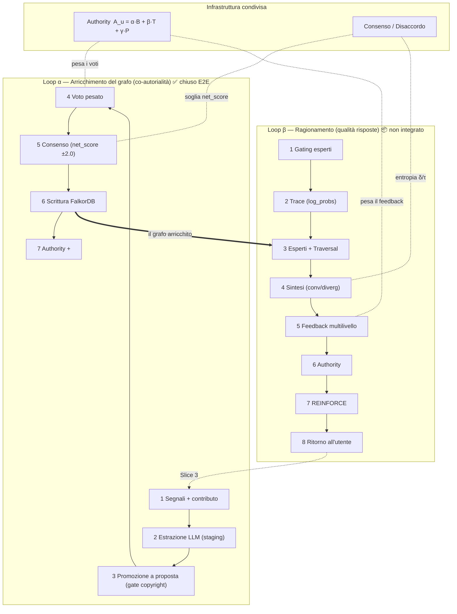

# MERL-T × RLCF — Mappa del sistema (esistente vs. target)

**Data:** 2026-05-28 · **Branch:** `visualex-merlt-main` · **Stato:** mappa di riferimento (sintesi)

**Scopo.** Documentare **il progetto `VisuaLexAPI`** (`/Users/gpuzio/Desktop/CODE/VisuaLexAPI`): (a) **cosa è implementato** qui oggi e (b) **come dovrebbe diventare** integrando, slice per slice, le capacità del sottosistema MERL-T. È una mappa di lettura, non un piano di lavoro.

**I due repo (per non confonderli).**
- **`VisuaLexAPI`** (questo repo — **il soggetto di questo documento**) = il **prodotto** rivolto all'avvocato (Quart API + Node BFF + React) + il **sidecar MERL-T** con il codice Python vendorizzato in `merlt/` + il **BFF** che lo integra. È dove i loop vengono *cablati e chiusi*.
- **`ALIS_CORE`** (`/Users/gpuzio/Desktop/CODE/ALIS_CORE`) = monorepo di ricerca **upstream**, *solo riferimento*: da lì provengono la visione, la teoria RLCF (tesi), il PRD/UX BMAD e la libreria `merlt/` che copiamo selettivamente (vedi `upstream-sync.md`). Non ci sviluppiamo: lo leggiamo per sapere dove andare.

> ⚠️ Questa mappa è **doc-grounded**: sintetizza la documentazione (che ha diverse derive di versione, vedi §8). Le righe marcate ✅ sono verificate nel nostro repo (CLAUDE.md + chiusura loop 2026-05-28); le righe 📦/🧪/📐/🐞 sono asserzioni dei doc di `ALIS_CORE` da verificare contro il codice prima di costruirci sopra.

**Legenda stati**

| Simbolo | Significato |
|---|---|
| ✅ | Implementato **e integrato** in VisuaLex (verificato E2E) |
| 📦 | Costruito nella **libreria `ALIS_CORE/merlt`**, NON integrato nel prodotto VisuaLex |
| 🧪 | Sperimentale / non in produzione |
| 📐 | Progettato (v2 o vision), non costruito |
| 🐞 | Costruito ma con **bug noti** che ne compromettono la qualità |

---

## 0. La tesi in dieci righe

MERL-T è un **«IDE per giuristi»**: l'avvocato pone una domanda giuridica, **quattro esperti ermeneutici** (letterale, sistematico, principi, precedente) percorrono un **grafo giuridico** e una sintesi restituisce una risposta tracciabile fino alla fonte/URN. Il sistema migliora con **RLCF** (Reinforcement Learning from Community Feedback): il feedback della comunità, **pesato per authority**, guida l'apprendimento.

Ma «RLCF» qui si manifesta in **due loop distinti** che condividono authority + consenso:

- **Loop α — Arricchimento del grafo / co-autorialità.** La comunità *costruisce il corpus*: propone nodi/relazioni, vota, e al consenso il nodo entra nel grafo. **Chiuso E2E in VisuaLex.**
- **Loop β — Ragionamento / qualità delle risposte.** La comunità *addestra il modello*: valuta le risposte Q&A su tre livelli e un policy-gradient aggiorna i pesi di gating/traversal. **Costruito in libreria, non integrato; con bug di pipeline aperti.**

La co-autorialità (la nostra UX) vive nel **Loop α**. Il **Loop β** è la frontiera (Slice 3).

---

## 1. Il progetto VisuaLexAPI (e cosa integra da MERL-T)

### 1.1 Cosa eseguiamo (runtime di VisuaLexAPI)
- **Python API — Quart, :5000** (`app.py`, `visualex_api/`): ricerca norme, scraping Normattiva/EUR-Lex/Brocardi, export PDF. È il cuore storico del prodotto.
- **Node BFF — Express + Prisma, :3001** (`backend/`): auth, dati utente, e **tutto il traffico MERL-T via `/api/merlt/*`** — il frontend non chiama mai il sidecar `:8000` direttamente.
- **Frontend — React + Vite, :5173** (`frontend/`): SPA; le superfici MERL-T (`/grafo`, `/merlt`, `/merlt/valida`, `/merlt/contribuisci`) sono montate via *plugin host*, dietro feature flag.
- **Sidecar MERL-T** (`docker-compose.merlt.yml`, gate `MERLT_ENABLED`): `merlt-api :8000` + `merlt-postgres` + `merlt-redis` + `merlt-falkordb` + `merlt-qdrant` + `merlt-worker` (RQ). Codice Python **vendorizzato in `merlt/`** (copia selettiva di `ALIS_CORE/merlt`).

### 1.2 La direzione che integriamo da MERL-T (visione upstream)
- **Paradigma:** *«IDE per Giuristi»* — l'avvocato pone una domanda, quattro esperti ermeneutici (art. 12 Preleggi: Positivismo/Finalismo/Costituzionalismo/Empirismo) percorrono il grafo, una sintesi risponde *tracciabile alla fonte/URN*. Momento «aha!»: *«I can use this reasoning trace in a legal brief.»*
- **Criteri di successo (PRD upstream):** 100% risposte con reasoning trace Expert→Source→URN; zero affermazioni non fontate; authority accurata ±10%.
- **Permessi:** *non* RBAC tradizionale — *«authority score determines influence, not role hierarchy»*.

> VisuaLexAPI adotta questa direzione **selettivamente, slice per slice** (Slice 1→2c fatte; Q&A/ragionamento = Slice 3). Tutto ciò che segue marca sempre cosa è già **in VisuaLexAPI** (✅) e cosa è ancora solo **upstream** (📦/📐/🧪).

---

## 2. I due loop RLCF (lo schema mentale chiave)

**Punto di giunzione:** il Loop α *produce e cura il grafo* che il Loop β *percorre per rispondere*. I due loop **condividono** il modello di authority e la macchina di consenso/disaccordo, ma usano soglie diverse (net_score ±2.0 nell'arricchimento; entropia di Shannon δ con τ=0.4 nel ragionamento).

---

## 3. Architettura del sottosistema MERL-T (target upstream)

> Questa è l'architettura *interna* del sidecar MERL-T come la definisce `ALIS_CORE`. VisuaLexAPI ne accende le capacità un pezzo per volta (vedi stato ✅/📦 nelle §4–§7); **non tutto è attivo nel nostro runtime**.

### 3.1 Layer

| Layer | Responsabilità | Componenti chiave | Stato (per doc ALIS) |
|---|---|---|---|
| Preprocessing | NER, intent, dominio; arricchimento KG della query | `query_understanding_module`, `kg_enrichment_service` | 📦 100% |
| Sources | scraping fonti ufficiali | `NormattivaScraper`, `BrocardiScraper`, `EurlexScraper` (stub) | 📦 (EUR-Lex 🧪) |
| Ingestion | doc → parse → chunk → embed → nodi + bridge | `IngestionPipelineV2`, `StructuralChunker`, `EnrichmentPipeline` | 📦 100% |
| Orchestration | routing query → esperti; pesi iniziali | `RouterV2`, `ExpertGatingNetwork` (θ_gating) | 📦 router; gating 📐/🧪 |
| Reasoning / Esperti | 4 esperti percorrono il grafo e interpretano | `Literal/Systemic/Principles/PrecedentExpert`, `AdaptiveSynthesizer` | 📦 v1 (autonomous `ExpertWithTools` 📐 0%) |
| Storage | grafo, vettori, bridge, RLCF, cache | FalkorDB, Qdrant, BridgeTable (Postgres), Redis | 📦 100% |
| Learning / RLCF | migliora i pesi dal feedback comunitario | `PolicyGradientTrainer`, replay buffer, authority | 📦 (multilivello v2 📐) |
| API Gateway | interfaccia HTTP, prefisso `/api/v1/` | `enrichment_router`, `experts_router`, `profile_router`, … | 📦 |

### 3.2 I quattro esperti (art. 12 Preleggi)

| Esperto | Canone | Relazioni privilegiate (prior θ_traverse) |
|---|---|---|
| **LiteralExpert** | Positivismo — «significato proprio delle parole» | `DEFINISCE` .95, `RINVIA` .90, `CONTIENE` .85 |
| **SystemicExpert** | Finalismo — «connessione di esse» (+ art. 14) | `APPARTIENE` .95, `MODIFICA` .90, `DEROGA` .85 |
| **PrinciplesExpert** | Costituzionalismo — «intenzione del legislatore» | `ATTUA` .95, `BILANCIA` .95, `DEROGA` .90 |
| **PrecedentExpert** | Empirismo — prassi giurisprudenziale | `INTERPRETA` .95, `OVERRULES` .95, `APPLICA` .85 |

Routing: `RouterV2` (chi attivare) → `GatingNetwork` (pesi softmax sui 4) → esecuzione parallela → `AdaptiveSynthesizer` (modo **convergent** se agreement > 0.7, altrimenti **divergent** che preserva il disaccordo). `LegalDisagreementNet` (BERT+LoRA, 📐) classifica il tipo di disaccordo.

### 3.3 Storage

| Store | Contenuto | Stato attuale (dev, per doc) |
|---|---|---|
| **FalkorDB** | grafo giuridico (Cypher) | **27.740 nodi, 43.935 relazioni** |
| **Qdrant** | embedding E5-large (1024-dim) | ~5.926 vettori |
| **Postgres — BridgeTable** | `chunk_id ↔ graph_node_id` + `weight` (apprendibile) | ~27.114 mapping |
| **Postgres — RLCF/Auth** | `rlcf_traces`, `rlcf_feedback`, `authority_scores`, `policy_checkpoints`, **`extraction_candidates`**, `pending_*` | operativo |
| **Postgres — Platform (Prisma)** | `User`, `Dossier`, `Merlt*` (consent/cache/job) | ✅ nostro |
| **Redis** | cache, rate-limit, coda RQ | operativo |

### 3.4 Schema del grafo (ontologia giuridica)

- **Nodi:** `Norma/Atto`, `Libro/Titolo/Capo/Sezione`, `Articolo`, `Comma`, `Lettera`; `ConcettoGiuridico`, `DefinizioneLegale`, `PrincipioGiuridico`; `Dottrina`, `AttoGiudiziario`/`Sentenza`, `Caso`; `SoggettoGiuridico`, `Ruolo`; `Procedura`, `Rimedio`, `Eccezione`, `Termine`… (i doc divergono sul set esatto — vedi §8).
- **Relazioni:** `DISCIPLINA`, `interpreta`, `APPLICA_A`, `contiene`, `IMPONE`, `ESPRIME_PRINCIPIO`, `ATTRIBUISCE_RESPONSABILITA`, `PREVEDE`, `DEFINISCE`, `STABILISCE_TERMINE`, `PREVEDE_SANZIONE`, `modifica`, `abroga`, `inserisce`, … (lo storage-layer arriva a ~65 tipi in 11 categorie; il FE ne stila ~15 in `graphStyles.ts`).

### 3.5 I quattro pilastri RLCF

1. **Authority dinamica** — l'autorità si *guadagna*, non si eredita dal titolo.
2. **Aggregazione che preserva l'incertezza** — il disaccordo è *informazione*, non rumore.
3. **Governance comunitaria & validazione trasparente** — ogni cambio di parametro è auditabile; ci sono tetti costituzionali (es. peso credenziali ≤ 0.6, soglia disaccordo ≥ 0.1).
4. **Devil's Advocate** — valutatori critici assegnati (authority > 0.5) per contrastare il groupthink.

### 3.6 La matematica (condivisa)

- **Authority:** `A_u(t) = α·B_u + β·T_u(t−1) + γ·P_u(t)`, con `T_u(t) = λ·T_u(t−1) + (1−λ)·Q_u(t)`, `λ = 0.95`. Pesi: **drift documentale** — `RLCF.md` usa `0.4/0.4/0.2`; tesi/slide/impl. usano `0.3/0.5/0.2` (§8). `B_u` da credenziali (studente 0.2, avvocato ~0.6, magistrato ~0.8).
- **Consenso (ragionamento):** disaccordo = entropia di Shannon normalizzata `δ = −(1/log|P|)·Σ ρ(p) log ρ(p)`, `δ∈[0,1]`. Soglie: `δ≤0.4` consenso · `0.4<δ≤0.6` incertezza con alternative · `δ>0.6` discussione strutturata.
- **Consenso (arricchimento):** somma dei voti **pesata per authority** ≥ **net_score 2.0** → `consensus_reached` (trigger PostgreSQL).
- **Reward/training (β):** REINFORCE con baseline — advantage `A = R − b`, loss `L = −Σ log π·A − 0.01·H`, clip 1.0, `lr 1e-4`, `b ← 0.99·b + 0.01·R`.

---

## 4. Loop α — Arricchimento del grafo (co-autorialità) ✅

Il loop che l'avvocato *guida*. **Chiuso E2E con dati reali il 2026-05-28** (vedi `slices/rlcf-loop/sprint-plan.md`).

| # | Fase | Meccanismo | Dove vive | Stato | Tocco dell'avvocato |
|---|---|---|---|---|---|
| 1 | Segnali + contributo | 5 segnali passivi (Slice 1) **persistiti** in `tracking_events`; upload note / proponi entità (Slice 2c) | FE trackers + BFF `/events`,`/contrib`; merlt `tracking_router`, `document_parser` | ✅ (A1) | passivo + **carica appunti** |
| 2 | Estrazione LLM | note → entità/relazioni candidate in **staging effimero** (TTL 48h) + dedup; gate copyright | merlt worker `extract_to_staging`; BFF `contribClient` | ✅ (B1: relazioni aggiunte) | rivede i candidati |
| 3 | Promozione a proposta | riformulazione + **attestazione** + fonte → `pending_entity`/`pending_relation` (mai il verbatim) | BFF `promotionGate` + `propose*` → merlt `enrichment` | ✅ | riformula, attesta, promuove |
| 4 | Validazione / voto | voti **pesati per authority** (approve/reject/edit) | FE `ValidationPage` + BFF `validate` → merlt `validate-entity/relation` | ✅ | **vota le proposte dei colleghi** |
| 5 | Aggregazione / consenso | net_score ≥ ±2.0 → `consensus_reached` (trigger PG) | merlt `consensus_triggers.py` + `enrichment_router:1217` | ✅ (A2 — *root cause: i trigger PG non erano installati*) | — |
| 6 | Promozione nel grafo | scrittura nodo/arco in FalkorDB, dedup 3 livelli; navigabile su `/grafo` | merlt `entity_writer.py` → FalkorDB; FE `graph/` | ✅ (A3) | **rilegge il nodo su `/grafo`** |
| 7 | Authority post-esito | delta authority a contributore + votanti concordi; cache lato VisuaLex | merlt `authority.py`/`orchestrator.py`; BFF `authorityCache` | ✅ (A4) | vede authority aggiornata su `/merlt` |

**Verifica E2E reale (2026-05-28):** note → 21 entità + 11 relazioni → candidato «Risoluzione del contratto per inadempimento» promosso → 4 voti (authority 0.5) → net_score 2.0 → nodo `:Concetto` collegato `[:DISCIPLINA]` all'art. 1453 c.c. in FalkorDB.

**Durabilità:** i fix Python sono baked nelle immagini `merlt-api`/`merlt-worker` dopo rebuild (alcune modifiche storiche erano via `docker cp`, effimere — verificare).

---

## 5. Loop β — Ragionamento / qualità risposte 📦

Il cuore accademico RLCF. **Costruito in libreria `ALIS_CORE/merlt` (~94% feature v1), ma NON integrato in VisuaLex** e con bug di pipeline aperti.

| # | Fase | Meccanismo | Stato | Gap principale |
|---|---|---|---|---|
| 1 | Query → selezione esperti | `GatingPolicy` (768→256→128→4 softmax) | 🧪 gating neurale sperimentale; in prod router **statico** | non usato nel routing live |
| 2 | Execution tracing | `ExecutionTrace` con `log_probs` → `rlcf_traces` | 📦 in libreria | il tracking VisuaLex era in-memory (A1 ha aggiunto `tracking_events`) |
| 3 | Esecuzione esperti + Traversal | esperti percorrono il grafo con `TraversalPolicy` | 📦 v1 · **🐞** | **i 4 esperti ricevono lo stesso retrieval**; `GraphSearchTool` rotto (`.execute_query` vs `.query`); grounding **20%** (80% fonti allucinate) con confidence 0.90 |
| 4 | Sintesi | `AdaptiveSynthesizer` convergent/divergent | 📦; **UI Q&A rimossa** | reintrodotta in Slice 3 |
| 5 | Feedback multilivello | 3 livelli (retrieval/reasoning/synthesis), authority-weighted | 📦 v1; `MultilevelFeedback` v2 📐 | nessuna UI Q&A che lo raccolga in VisuaLex |
| 6 | Authority update | `A_u` ricalcolata | ✅ infra condivisa · 🐞 | **calibrazione**: in EXP-023 i `random_noise` salgono a +370% |
| 7 | Policy gradient | REINFORCE su gating/traversal/rerank/bridge | 📦 trainer pronto; **training MANUALE** (A5: endpoint admin) | non agganciato all'inference live; no auto-training |
| 8 | Ritorno all'utente | risposta con **incertezza calibrata** + devil's advocate | 📐 Slice 3 | non costruito in VisuaLex |

**Validazione empirica.** `EXP-021` fornisce il framework statistico (4 ipotesi: persistenza, convergenza authority, stabilità pesi, miglioramento risposte) ma non risulta eseguito con esperti reali. `EXP-023` (completato): il loop **funziona meccanicamente** (query→expert→feedback→update validato; authority converge), ma **i target di performance non sono raggiunti** (reward +8.1% vs +15%; load balance 0.49–0.63 vs 0.75; nessun early stopping → overfitting) e l'authority va ricalibrata.

---

## 6. Infrastruttura condivisa (dettaglio)

- **Authority** — calcolata **lato VisuaLex** (`B_u` da qualifica) e **iniettata a ogni chiamata** verso MERL-T (`user_authority`); MERL-T la usa per pesare ma non è l'autorità della verità. **Decadimento temporale (`λ=0.95`) specificato ma non implementato** nel modello live (somma statica). Calibrazione debole (EXP-023).
- **Consenso/disaccordo** — due regimi: net_score ±2.0 (arricchimento) e entropia δ/τ con tassonomia legale a 6 tipi (ANT/LAC/MET/OVR/GER/SPE, `DISAGREEMENT_DETECTION_SPEC`, 📐 non addestrato).
- **Governance** — tetti costituzionali (credenziali ≤ 0.6, soglia ≥ 0.1), audit log, ciclo di training a 14 giorni (📐).

---

## 7. Matrice ESISTENTE vs TARGET

| Capability | Libreria `ALIS_CORE` | Integrato in VisuaLex | Note / gap |
|---|---|---|---|
| Consenso & privacy | 3 livelli Basic/Learning/Research | ✅ none/basic/full | **enum diversi** (§8) |
| 5 segnali d'uso (tracking) | adapter feedback | ✅ persistiti (A1) | tassonomia 17 interazioni parzialmente superata |
| Grafo read-only (`/grafo`) | API grafo | ✅ Slice 2a (seed 27.7k, lazy ingest) | — |
| Contributo (note→staging→promote) | `document_parser`, staging | ✅ Slice 2c | estrazione relazioni B1 ✅ |
| Validazione (voto pesato) | `validate-*`, pending_* | ✅ Slice 2c | — |
| Consenso → scrittura grafo | trigger + `entity_writer` | ✅ (A2/A3) | trigger PG ora installati |
| Authority post-esito | `authority.py` | ✅ (A4) | decadimento 📐; calibrazione 🐞 |
| Training RL | `PolicyGradientTrainer` | ✅ **solo** endpoint admin manuale (A5) | non agganciato a routing live |
| **Q&A multi-esperto** | orchestrator + sintesi | 📦 **non integrato** (UI rimossa) | Slice 3 |
| Gating neurale in prod | `GatingPolicy` | 🧪 | router statico in prod |
| `ExpertWithTools` (v2) | — | 📐 0% | redesign autonomous-tools |
| Authority multilivello/per-dominio | — | 📐 0% | global only |
| Devil's Advocate (UX) | logica 📦 | 📐 | UX Slice 3 |
| Disagreement neural net | `LegalDisagreementNet` | 📐 | non addestrato |
| Pipeline retrieval per-esperto | — | 🐞 | bug grounding 20% |

---

## 8. Contraddizioni / incongruenze da risolvere

1. **Enum consenso:** ALIS = `Basic/Learning/Research`; VisuaLex = `none/basic/full`. Serve una mappa documentata (Learning≈basic, Research≈full).
2. **`check-article`:** doc vecchi `in_graph: bool`; doc/codice attuali `exists: bool`. Il nostro `graphClient` usa `exists` (corretto).
3. **Porte MERL-T:** doc oscillano tra `:8000` e `:8001`; il nostro compose espone `:8000` dall'host. Regola ferma: **il FE non chiama mai `:8000`**, tutto via BFF `/api/merlt/*`.
4. **Authority pesi `α/β/γ`:** `0.4/0.4/0.2` (RLCF.md) vs `0.3/0.5/0.2` (tesi/impl). Scegliere il canonico.
5. **Esperti v1 vs v2:** in prod girano gli esperti *passivi* v1; `ExpertWithTools` (autonomo) è 📐 0%.
6. **`merlt/contract-matrix.md`** dichiarava ~44 endpoint «implementato» ma ~20 (`/experts/*`, `/enrichment/*`, `/ops/*`) **non sono montati** sul BFF. ✅ *Risolto:* banner correttivo + elenco di cosa è montato oggi.
7. **`merlt/integration.md`** aveva un `MERLT_ROOT=…/ALIS_CORE/merlt` hardcoded. ✅ *Risolto:* corretto a `$(pwd)/merlt` + banner sullo stato reale.
8. **Bug pipeline (β):** stesso retrieval per i 4 esperti, `GraphSearchTool` rotto, grounding 20%. Da risolvere prima di esporre il Q&A (Slice 3).
9. **Roadmap stale:** `ROADMAP_COMPLETE_2026` marca «Phase 1 Not Started» mentre `CURRENT_STATE` (3 gg dopo) la dà completa.

---

## 9. Dove si innesta la co-autorialità (UX)

La filosofia «provenienza e deliberazione in lessico giuridico, mai punteggi» (vedi `coauth-ux-prompt.md`) agisce sul **Loop α**, fasi 3–7:
- **fase 3–4** (proposta/voto) → *parere* e *adesione/dissenso* (`/merlt/valida`, `/merlt/contribuisci`);
- **fase 6** (nodo nel grafo) → *provenienza* «Proposto da @X · su fonte · accolto il…» nel `NodeDetailsDrawer` (`/grafo`), riusando `AttributionChip`;
- **fase 7** (authority) → *qualifica*, non punteggio.

Il **Loop β** (Q&A di ritorno con incertezza calibrata) è il terreno della **Slice 3**, e prima va sanata la pipeline (§8.8).

---

## 10. Fonti autorevoli

**Visione & teoria (ALIS_CORE):**
- `merlt/docs/thesis/RLCF_TECHNICAL_DOCUMENT.md` — le 8 fasi del Loop β, REINFORCE, math.
- `merlt/docs/rlcf/RLCF.md` + `.../reference/rlcf-formulas-explained.md` — 4 pilastri, authority, consenso.
- `merlt/docs/architecture/{overview,reasoning,storage-layer,learning-layer}.md` — layer, esperti, schema KG.
- `merlt/docs/architecture/DISAGREEMENT_DETECTION_SPEC.md` — tassonomia disaccordo.
- `_bmad-output/planning-artifacts/{prd,ux-design-specification,epics}.md` — prodotto/UX/epiche.
- `merlt/docs/experiments/EXP-021…`, `EXP-023…` — validazione empirica del loop.
- `merlt/docs/MERL_T_IMPLEMENTATION_STATUS.md`, `PIANO_DEFINITIVO_INTEGRAZIONE.md`, `architecture/PIPELINE_ANALYSIS.md` — stato e bug.

**Implementazione (VisuaLexAPI):**
- `CLAUDE.md` (sezioni MERL-T Slice 1→2c) — verità del nostro repo.
- `slices/rlcf-loop/sprint-plan.md` — chiusura Loop α E2E.
- `slices/slice*/design.md` — design delle 4 slice.
- `upstream-sync.md` — cosa è vendorizzato e perché.
